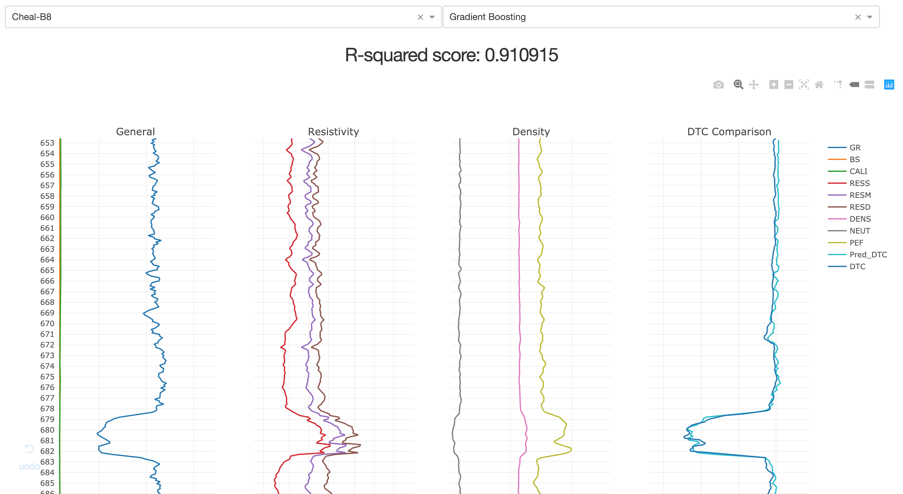

# ET-earth-hack
This is the repository for one of top three winning solutions at EAGE Earth-Hack Hackathon. The team was representing Exploration Technology department of PETRONAS Research Sdn Bhd.

## Interface

## presentation
This work was also presented during EAGE Workshop on Big Data and Machine Learning for E&P Efficiency. The slides could be found at:
https://docs.google.com/presentation/d/1WqjYF8XlSNDb8dTyBf0Bkd2OwqX_nrxH7TXV8AwVJcM/edit?usp=sharing

## installation guide
1. run 'pip install -r requirements.txt'
